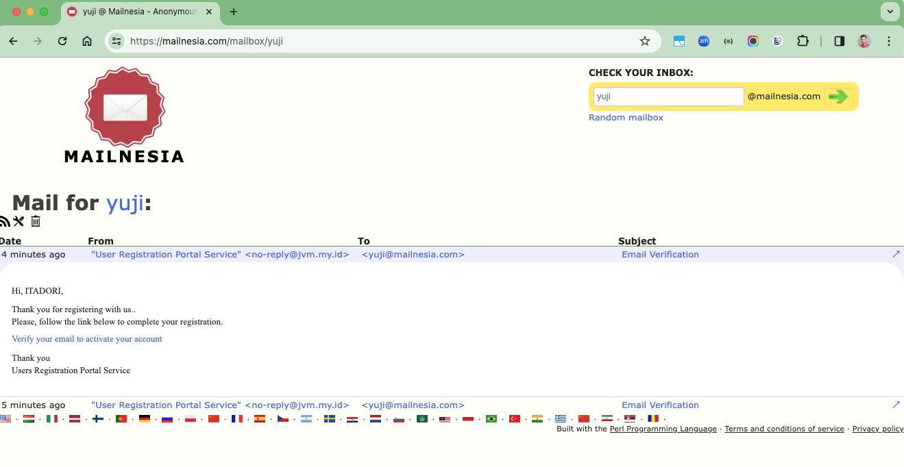
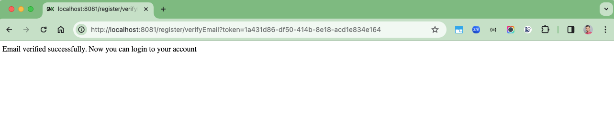
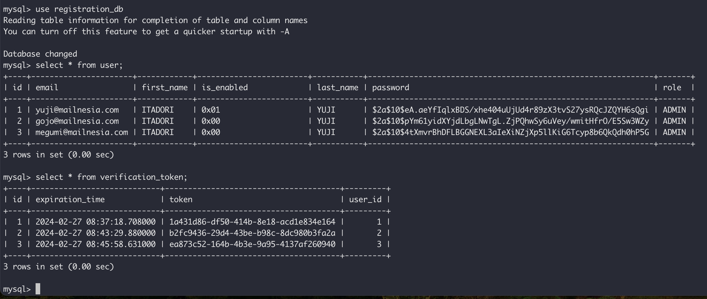

# spring-boot-email-verification-demo

### Things todo list

1. Clone this repository: `git clone https://github.com/hendisantika/spring-boot-email-verification-demo.git`
2. Navigate to the folder: `cd spring-boot-email-verification-demo`
3. Change with your DB & SMTP E-Mail credentials in `application.yml` file
4. Run the application: `mvn clean spring-boot:run`
5. Open HTTP Client App (Postman, Insomnia or API Dog)

### Image Screenshot

Send E-Mail API

Verification E-Mail

E-Mail Verified

Database State

